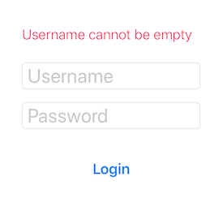

# Login Test App

Sample unit test for a simple login view controller

Test is located in `LoginViewControllerTests.swift`

The test will check 

1. Error message should not show when login screen is first presented
2. When username text field is left blank and login button is tapped, an error message should show
3. When password text field is left blank and username text field is not blank and login button is tapped, an error message should show
4. When username text field is not blank and password text field is not blank and login button is tapped, an alert should show

